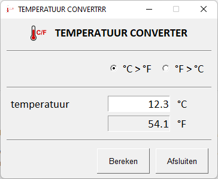
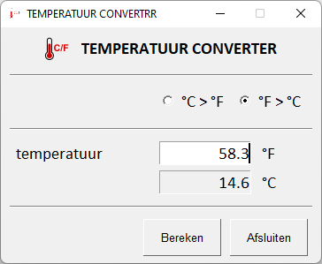
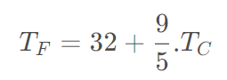
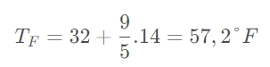
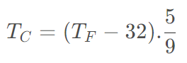
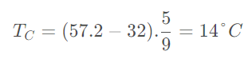
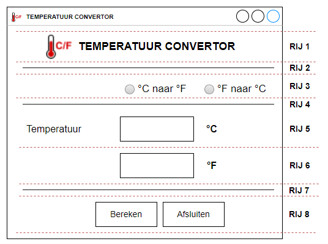
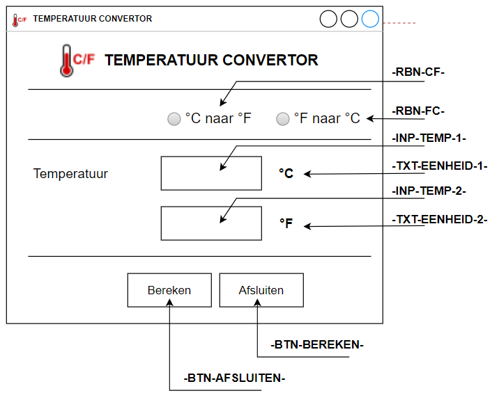

# Oefening 03

We maken in dit project een 'temperatuur converter', een calculator waarmee we een temperatuur in graden Celsius omzetten in graden Fahrentheit of omgekeerd.

## Doel

We maken een kleine applicatie met een grafische gebruikersinterface waarbij de gebruiker een temperatuur kan opgeven en kan selecteren of de temperatuur omgezet wordt van graden Celsius naar graden Fahrentheit of omgekeerd.

Onderstaand screenhots tonen het beoogde doel.



&nbsp;



## Structuur van het project

De structuur van het project staat hieronder afgebeeld en volgt de structuur van het vorige project.

```python
│   main.py
│
├───app
│   │   app.py
│   │   app_layout.py
│
├───assets
│       favicon.ico
│       logo.png
│
├───bin
└───entiteit
    │   converter.py
```

We onderscheiden:

* main.py  
  hoofdapplicatie, enige doel van dit bestand is de applicatie te starten
* app  
  map met Python-script voor de applicatie:
  * app.py  
    de eigenlijke applicatie, bevat de klasse 'App' en staat in voor het weergeven van de gebruikersinterface en het afhandelen van gebeurtenissen
  * app_layout.py  
    dit bestand bevat de elementen waaruit de grafische gebruikersinterface opgebouwd wordt
* assets  
  deze map bevat bestanden die in de applicatie gebruikt worden maar geen deel uitmaken van de applicatie, bijvoorbeeld logo en favicon
* bin  
  map waaraan we Python-scripts toevertrouwen ter ondersteuning van de applicatie
* entiteit  
  aan deze map kennen we entiteitklassen toe
  * convert.py   
    bevat de entiteitklasse 'Convertor' die instaat voor het omrekenen van de temperatuur

## De klasse 'Converter'

### Temperatuur omrekenen

In onderstaande formules worden volgende symbolen gebruik:

* T<sub>C</sub>: temperatuur in graden Celsius (°C)

* T<sub>F</sub>: temperatuur in graden Fahrentheir (°F)

**Temperatuur van graden Celsius naar graden Fahrentheit**

De volgende formuler wordt gebruikt om de temperatuur in graden Celsius T<sub>C</sub> om te zetten naar graden Fahrentheid T<sub>F</sub>.



Voorbeeld: temperatuur in graden Celsius: 14°C



**Temperatuur van graden Fahrentheit naar graden Celsius**

De volgende formuler wordt gebruikt om de temperatuur in graden Fahrentheid T<sub>F</sub> om te zetten naar graden Celsius T<sub>C</sub>.



Voorbeeld: temperatuur in graden Fahrentheit : 57,2°F



## De grafische gebruikersinterface

De grafische gebruikersinterface of GUI kunnen we opdelen in 8 rijen.



We onderscheiden:

* **RIJ 1**
  
  * `Image()`  
    bevat het logo
  
  * `Text()`  
    bevat de titel van de applicatie
  
  * centreer de inhoud met `Push()`-elementen

* **RIJ 2**
  
  * `HorizontalSeparator()`

* **RIJ 3**
  
  * `Radio()`  
    '*radiobutton*', koppel beide radiobuttons aan elkaar met de eigenschap  `group_id`.  Kan aan beide radiobuttons een `key` toe.  Maak gebruik van de eigenschap `enable_events` om een gebeurtenis te triggeren wanneer een radiobutton geselecteerd wordt.
  
  * lijn de elementen naar rechts uit met een `Push()`-element

* **RIJ 4**
  
  * `HorizontalSeparator()`

* **RIJ 5 en RIJ 6**
  
  * `Text()`  
    voor de label links, met de eigenschap `size` ken je 15x1 toe.
  
  * `Input()`  
    invoerveld.  Ken een `key` toe, grootte (`size`) 10x1.  De inhoud lijn je rechts uit.  Zorg ervoor dat de gebruiker alleen een temperatuurwaarde kan ingeven in het eerste tekstveld
  
  * `Text()`  
    voor de eenheden maak je gebruik van een element `Text()`.  De inhoud van dit element correspondeert met de geselecteerde radiobutton, m.a.w. is `°C naar °F` geselecteerd, dan staat bovenaan de eenheid °C en onderaan °F, is de andere radiobutton geselecteerd, dan staan de eenheden omgedraaid.  De eenheden zet je bijgevolg dynamisch.

* **RIJ 7**  
  
  * `HorizontalSeparator()`

* **RIJ 8**
  
  * `Button()`  
    knoppen
  
  * duw de knoppen naar rechts met een `Push()`-element.

Hieronder de opbouw van de gebruikersinterface.


